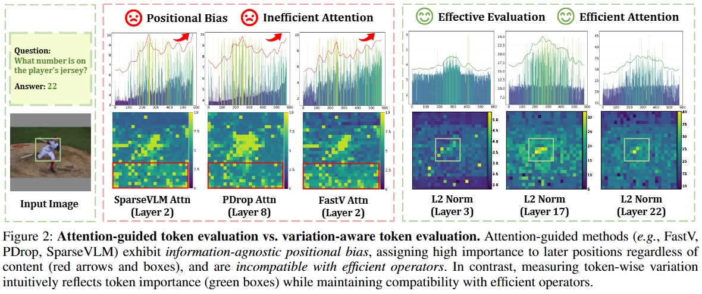

<div align=center>

<h1> 🧷 Variation-aware Vision Token Dropping for Faster Large Vision-Language Models 🚀 </h1>

<h4 align="center"> 

[Junjie Chen]()<sup>1*</sup>,
[Xuyang Liu](https://xuyang-liu16.github.io/)<sup>1*,†</sup>,
[Zichen Wen](https://scholar.google.com/citations?hl=en&user=N-aPFvEAAAAJ)<sup>2</sup>,
[Yiyu Wang]()<sup>2</sup>,
[Siteng Huang](https://kyonhuang.top/)<sup>3</sup>,
[Honggang Chen](https://sites.google.com/view/honggangchen/)<sup>1✉</sup>

<sup>1</sup>Sichuan University, <sup>2</sup>EPIC Lab, Shanghai Jiao Tong University, <sup>3</sup>Zhejiang University

</h4>

</div>

## 🔥 News

* **`2025.08.27`** 🤗🤗 We release our latest work [V<sup>2</sup>Drop](https://arxiv.org/abs/2509.01552), a variation-aware vision token dropping method for plug-and-play inference LVLM acceleration. [Code](https://github.com/xuyang-liu16/V2Drop) is available!


<p align="center">  </p>

> **TLDR:** Token-wise variation intuitively reflects vision token importance (green boxes) while maintaining compatibility with efficient operators. Thus, we present VidCom<sup>2</sup>, a plug-and-play framework that measures token-wise variation across adjacent LLM layers and progressively drops vision tokens with minimal variation, thereby achieving plug-and-play inference acceleration.

## 💥 Core Codes

The core implementation of our code is in [`llava/model/language_model/V2Drop.py`](https://github.com/xuyang-liu16/V2Drop/blob/main/llava/model/language_model/V2Drop.py).

## 🛠 Preparation
### LLaVA
1. Clone this repository.

```bash
git clone https://github.com/xuyang-liu16/V2Drop
cd DART
```

2. Environment Setup and Preparation

```Shell
 conda create -n V2Drop python=3.10 -y
 conda activate V2Drop
 pip install -e .
 pip install flash-attn --no-build-isolation
```

3. Download Multimodal Benchmark

Please follow the detailed instruction in [LLaVA-Evaluation](https://github.com/haotian-liu/LLaVA/blob/main/docs/Evaluation.md).

4. Download [LLaVA-1.5-7B](https://huggingface.co/liuhaotian/llava-v1.5-7b) and put them under `./liuhaotian/llava-v1.5-7b`.

> For users with limited access to Hugging Face (e.g., from mainland China), you can refer to this you can refer this [alternative guide](https://cloud.baidu.com/article/3251091) and use the following command, with LLaVA-1.5-7B as an example:
```
pip install -U huggingface_hub hf_transfer -i https://mirrors.aliyun.com/pypi/simple/
export HF_ENDPOINT=https://hf-mirror.com
huggingface-cli download --resume-download liuhaotian/llava-v1.5-7b --local-dir ./liuhaotian/llava-v1.5-7b
```

## 🚀 Evaluation

Example for evaluating TextVQA results:
```
CUDA_VISIBLE_DEVICES=0 bash scripts/v1_5/eval/textvqa.sh
```
Example for evaluating MME results:
```
CUDA_VISIBLE_DEVICES=0 bash scripts/v1_5/eval/mme.sh
```

## 📌 Citation

Please consider citing our paper in your publications, if our findings help your research.

```bibtex
@misc{chen2025variationawarevisiontokendropping,
      title={Variation-aware Vision Token Dropping for Faster Large Vision-Language Models}, 
      author={Junjie Chen and Xuyang Liu and Zichen Wen and Yiyu Wang and Siteng Huang and Honggang Chen},
      year={2025},
      eprint={2509.01552},
      archivePrefix={arXiv},
      primaryClass={cs.CV},
      url={https://arxiv.org/abs/2509.01552}, 
}
```
